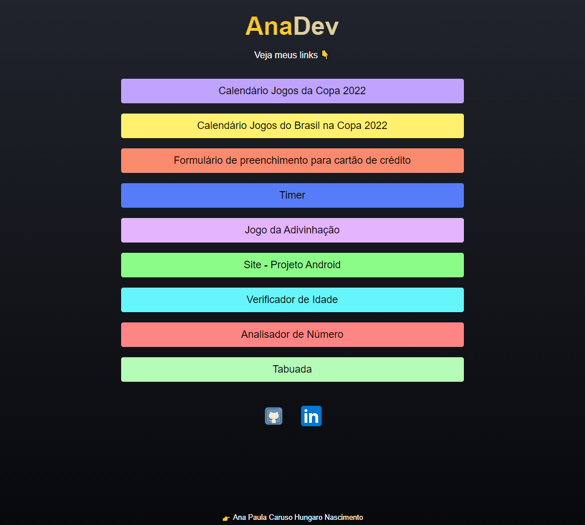

<h1 align="center"> Site - Portfólio </h1>

  <a href="#-tecnologias">Tecnologias</a>&nbsp;&nbsp;&nbsp;|&nbsp;&nbsp;&nbsp;
  <a href="#-projeto">Projeto</a>&nbsp;&nbsp;&nbsp;|&nbsp;&nbsp;&nbsp;
  <a href="#-layout">Layout</a>&nbsp;&nbsp;&nbsp;|&nbsp;&nbsp;&nbsp;
  <a href="#memo-licença">Licença</a>

  

 

  

## 🚀 Tecnologias

Esse projeto foi desenvolvido com as seguintes tecnologias:

- HTML e CSS
- Git e Github

## 💻 Projeto

Desenvolvi um site para apresentar meu portfólio com uma compilação de amostras de alguns dos meus projetos realizados e estudos. Para interagir com os programas é só clicar no link e você será direcionado para a página do projeto escolhido. 

## :memo: Licença

Esse projeto está sob a licença MIT.

---

